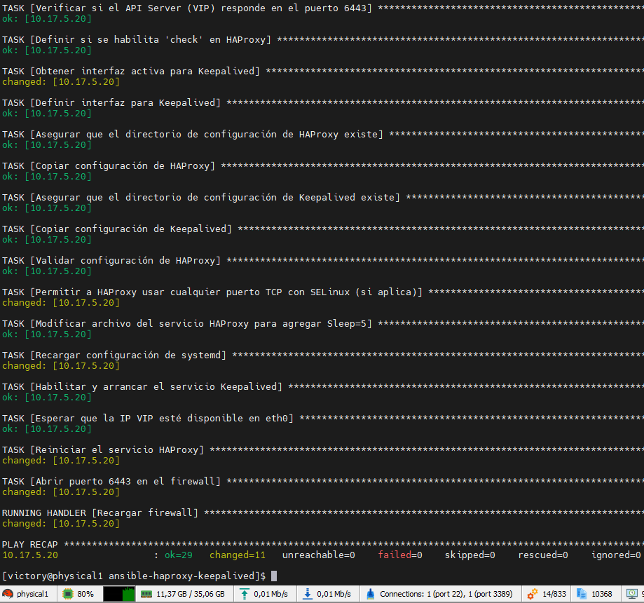

# 🧰 HAProxy + Keepalived Deployment (Ansible)

Este repositorio despliega un balanceador de carga con alta disponibilidad usando **HAProxy** y **Keepalived** para clústeres Kubernetes (K3s o K8s tradicionales).

---

## 🚀 Requisitos

- Servidores con AlmaLinux, Rocky Linux, CentOS o similares
- Ansible instalado en el nodo de control
- Acceso SSH sin contraseña a los nodos
- IP virtual (VIP) predefinida para el clúster

---

## 📁 Inventario de ejemplo (`inventory/hosts.ini`)

```ini
[haproxy_keepalived]
10.17.5.10 ansible_user=core ansible_ssh_private_key_file=~/.ssh/id_rsa_key_cluster_openshift ansible_port=22 ansible_shell_executable=/bin/sh

[masters]
10.17.4.21
10.17.4.22
10.17.4.23

[workers]
10.17.4.24
10.17.4.25
10.17.4.26
```

---

## 📦 Ejecución

```bash
sudo ansible-playbook -i inventory/hosts.ini ansible/playbooks/install_haproxy_keepalived.yml
```

---

## 📜 Archivos de plantilla

- `templates/haproxy/haproxy.cfg.j2`: configuración del balanceo de carga para API (6443), HTTP (80) y HTTPS (443)
- `templates/keepalived/keepalived.conf.j2`: define la IP virtual (VIP) compartida entre los nodos

---

## ✅ Resultado esperado

- El servicio `haproxy` estará escuchando en los puertos 6443, 80 y 443.
- El servicio `keepalived` gestionará la IP virtual compartida.
- El VIP estará disponible antes de desplegar K3s con TLS correcto.


## 📸 Ansible HAproxy VIP OK



---


> Proyecto independiente para usarse como prerequisito en arquitecturas como [FlatcarMicroCloud](https://github.com/vhgalvez/FlatcarMicroCloud)


## 📜 Licencia este proyecto está licenciado bajo la **Licencia MIT** [text](LICENSE).
